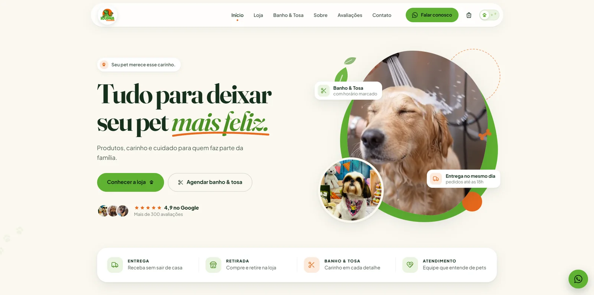

<p align="center">
  
</p>

<p align="center">
  
  
  
  
</p>

<p align="center">
  Demo de site próprio para um pet shop real de Curitiba, criada para ser apresentada ao
  estabelecimento e mostrar como a marca poderia ter uma presença digital mais moderna e profissional.
</p>

<p align="center">
  <a href="https://lorenzo-or7.github.io/iguana-emporio-pet-demo/"><b>🔗 Acessar o site</b></a>
</p>

---

## 🖥️ Preview

<p align="center">
  
</p>

---

## 📌 Sobre o projeto

O pet shop não tinha um site próprio que reunisse produtos, serviços, lojas e contatos em um só lugar,
com a cara da marca. A proposta foi criar uma demonstração visual para oferecer ao estabelecimento,
mostrando o potencial de um site feito sob medida.

A identidade partiu das cores da própria Iguana: **verde** como cor principal e **laranja** como destaque,
com formas arredondadas e um visual amigável, moderno e acolhedor, sem parecer um template genérico de pet shop.

---

## ✨ Funcionalidades

- 🏠 Página inicial com os diferenciais da loja
- 🛍️ Principais produtos e categorias
- 🛁 Área dedicada ao banho e tosa
- 🛵 Horários de delivery e programa de cashback
- ⭐ Avaliações de clientes
- 📍 Sobre a empresa e localização das lojas
- 📲 Integração com WhatsApp, Instagram e mapa
- 🌗 Tema claro e escuro, com animações suaves
- 📱 Interface responsiva

---

## 🛠️ Tecnologias

- **HTML5** para a estrutura
- **CSS3** para a identidade visual e a responsividade
- **JavaScript** para interações, animações, troca de tema e menus
- **GitHub Pages** para hospedagem

---

## ⚙️ Como rodar

Não precisa instalar nada: baixe o repositório e abra o arquivo `index.html` no navegador.

```bash
git clone https://github.com/lorenzo-or7/iguana-emporio-pet-demo.git
```

> Este é um projeto demonstrativo: não possui backend, banco de dados nem sistemas reais de compra e agendamento.

---

## 👨‍💻 Autor

<p>
  Feito por <b>Lorenzo Orsetti</b><br/>
  <a href="https://lorenzo-or7.github.io">
    
  </a>
  <a href="https://www.linkedin.com/in/lorenzo-orsetti-031906349/">
    
  </a>
  <a href="https://github.com/lorenzo-or7">
    
  </a>
</p>

<p align="center">
  
</p>
